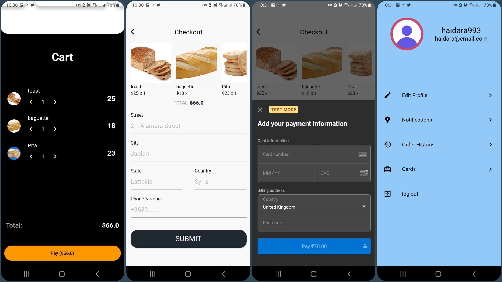

# HedoraShop
an ecommerce app built with flutter and nodeJS.

state management: GetX.

MVVM(Model-View-(View)Model) Architecture.

## Getting started
for the database get connection string from mongodb dashboard and place it in .env file in the nodejs backed.

for nodejs backed run npm install to install the packages then npm start to start local server.

for the flutter app run flutter pub get to install packages, then set const DOMAIN in the file lib/helpers/hhtp_helpers.dart to your local setup.

## FeatureS

| UI            | Logic         | Feature  |
| ------------- | ------------- | -------- |
| :heavy_check_mark:          | :heavy_check_mark:         | Sign up page  |
| :heavy_check_mark:           | :heavy_check_mark:         | Sign in page  |
| :heavy_check_mark:           | :heavy_check_mark:         | Home page  |
| :heavy_check_mark:           | :heavy_check_mark:         | Cart page  |
| :heavy_check_mark:           | :heavy_check_mark:         | Details page  |
| :heavy_check_mark:           | :heavy_check_mark:         | Checkout page  |
| :heavy_check_mark:           | :heavy_check_mark:         | Category view page  |
| :heavy_check_mark:           | :heavy_check_mark:         | Search result page  |
| :heavy_check_mark:           | :heavy_check_mark:         | Profile page  |
| :heavy_check_mark:           | :heavy_check_mark:         | Order History page  |
| :x:           | :x:         | Edit Profile page  |
| :x:           | :x:         | Cards page  |
| :x:           | :x:         | Notifications page  |

## Database 
the app use mongodb database you need to make an account on mongodb then get the connection string and replace it in .env file in nodejs api.

## Stripe Payment 💳
the app use stripe payment getway you need to make an account and get "publishableKey" and "SecretKey" and put them in your app.

the app has its own test keys that you can use.

use these test info:

card number 4242 4242 4242 4242

date : any future date.

cvc: random 3 digits.

postcode : random postcode.

## Screenshots

